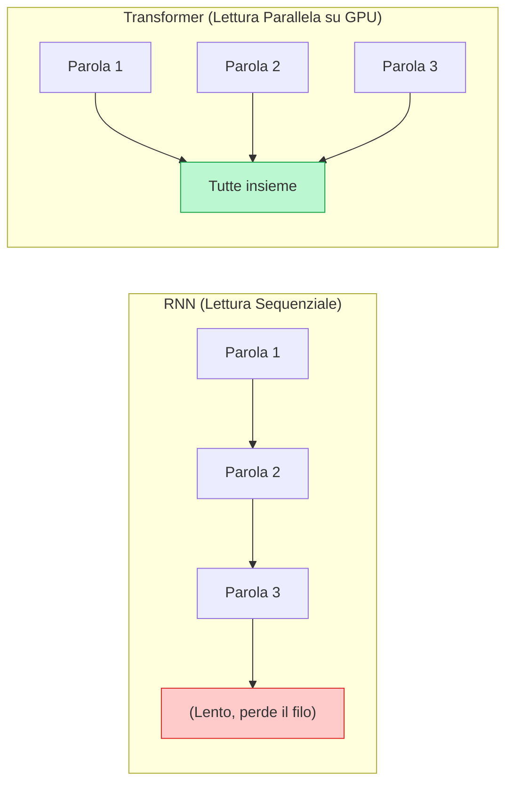
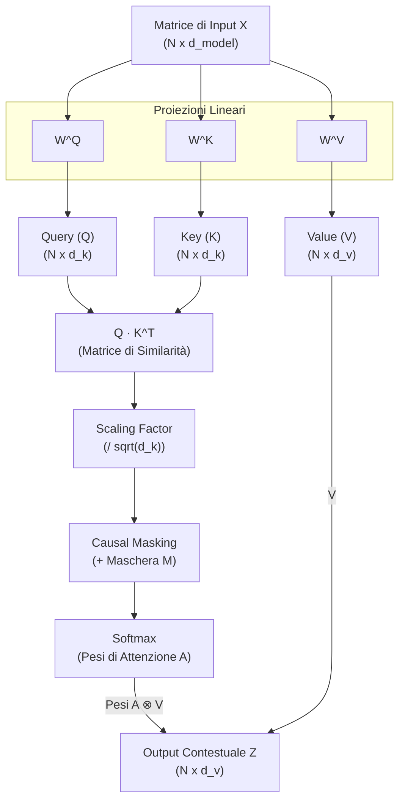

---
aliases:
- D09
- Transformers
- LLM
- Large Language Models
- Self-Attention
- Ingegneria dell'Inferenza
- llama.cpp
- vLLM
resources:
- title: 'Let''s build GPT: from scratch (Andrej Karpathy)'
  url: https://www.youtube.com/watch?v=kCc8FmEb1nY
  type: video
- title: Attention in transformers (3Blue1Brown)
  url: https://www.youtube.com/watch?v=eMlx5fFNoYc
  type: video
- title: Transformer Explainer (Interattivo 3D)
  url: https://poloclub.github.io/transformer-explainer/
  type: lab
---
# Architettura dei Transformer, Large Language Model e Ingegneria dell'Inferenza

# Architettura dei Transformer, Large Language Model e Ingegneria dell'Inferenza

Fino al 2017, il **problema** principale nel far leggere testi ai computer era la lentezza: le reti neurali dell'epoca (RNN e LSTM) dovevano leggere le parole rigorosamente in fila, una dopo l'altra. Questa dipendenza temporale impediva di usare la potenza di calcolo parallela delle moderne schede video (GPU). Più il testo era lungo, più il modello dimenticava le prime parole, rendendo impossibile addestrare IA su interi libri o su enormi dataset.

La **soluzione** che ha sconvolto l'industria è stata inventata dai ricercatori di Google e DeepMind con il paper [Attention Is All You Need (Vaswani et al., 2017)](https://arxiv.org/abs/1706.03762). Hanno eliminato la lettura sequenziale sostituendola con un meccanismo di auto-attenzione (*Self-Attention*). In questa architettura (il **Transformer**), la rete guarda *tutte* le parole della frase nello stesso esatto momento. 



L'architettura Transformer costituisce oggi il motore computazionale primario di tutti i moderni Large Language Model (LLM), permettendo per la prima volta l'addestramento su miliardi di parole contemporaneamente e rivoluzionando i campi della generazione di codice e dell'OSINT.

## Formulazione Matematica e Geometrica della Self-Attention

Il meccanismo di Self-Attention elabora una matrice di input formata da vettori di embedding associati a ciascun token della sequenza. Data una matrice di input $X \in \mathbb{R}^{N \times d_{\text{model}}}$, dove $N$ rappresenta la lunghezza della sequenza e $d_{\text{model}}$ la dimensione dello spazio latente, il modello proietta linearmente $X$ in tre distinti spazi vettoriali mediante matrici di peso addestrabili: la matrice delle interrogazioni $W^Q \in \mathbb{R}^{d_{\text{model}} \times d_k}$, la matrice delle chiavi $W^K \in \mathbb{R}^{d_{\text{model}} \times d_k}$ e la matrice dei valori $W^V \in \mathbb{R}^{d_{\text{model}} \times d_v}$.

$$Q = X W^Q, \quad K = X W^K, \quad V = X W^V$$

La proiezione genera le matrici di Query $Q \in \mathbb{R}^{N \times d_k}$, Key $K \in \mathbb{R}^{N \times d_k}$ e Value $V \in \mathbb{R}^{N \times d_v}$. Da una prospettiva geometrica, ogni riga di $Q$ funge da vettore di ricerca orientato nello spazio semantico per interrogare le caratteristiche dei token circostanti; le righe di $K$ fungono da etichette descrittive del contenuto di ciascun token; le righe di $V$ contengono l'effettivo contenuto informativo da estrarre e ricombinare linearmente per formare la nuova rappresentazione contestuale.



La quantificazione dell'affinità semantica tra il token $i$-esimo e il token $j$-esimo avviene tramite il prodotto scalare tra il rispettivo vettore di query $q_i$ e il vettore di chiave $k_j$. Quando due vettori puntano nella medesima direzione nello spazio vettoriale, il loro prodotto scalare assume un valore elevato, segnalando una forte rilevanza contestuale. La moltiplicazione matriciale $Q K^\top$ calcola simultaneamente tutti gli $N \times N$ prodotti scalari della sequenza.

All'aumentare della dimensione $d_k$, il valore atteso dei prodotti scalari cresce linearmente in magnitudo, spingendo i valori in ingresso alla funzione Softmax verso regioni a saturazione estrema dove i gradienti risultano prossimi allo zero. Per preservare la stabilità numerica e garantire gradienti robusti durante l'addestramento, il prodotto scalare viene normalizzato mediante un fattore di scala pari a $\frac{1}{\sqrt{d_k}}$. L'equazione canonica della Scaled Dot-Product Attention assume la forma:

$$\text{Attention}(Q, K, V) = \text{Softmax}\left(\frac{Q K^\top}{\sqrt{d_k}} + M\right) V$$

La matrice di mascheramento $M \in \mathbb{R}^{N \times N}$ è impiegata nei modelli generativi autoregressivi per preservare il principio di causalità: per ciascun elemento con indice temporale futuro ($j > i$), viene assegnato un valore pari a $M_{ij} = -\infty$, azzerando rigorosamente la probabilità calcolata dalla Softmax e impedendo al token presente di accedere ad informazioni future.

<div class="admonition abstract">
  <p class="admonition-title">Animazione Interattiva: Self-Attention</p>
  <p>Passa il mouse sopra ogni parola della frase per vedere i <strong>pesi di attenzione</strong>. Una parola (la <em>Query</em>) cerca informazioni in altre parole (le <em>Key</em>) per disambiguare il proprio significato, e "assorbe" i loro valori (<em>Value</em>). Nota come il pronome "esso" debba guardare a "robot" per essere decodificato correttamente.</p>
  <iframe src="../widgets/attention.html" style="width: 100%; height: 500px; border: none; border-radius: 8px; overflow: hidden; box-shadow: 0 4px 6px rgba(0,0,0,0.05);"></iframe>
</div>

### Multi-Head Attention e Proiezioni in Sottospazi Multipli

Una singola operazione di attenzione tende a mediare l'informazione concentrandosi su una sola relazione dominante alla volta. Per consentire al modello di monitorare congiuntamente differenti tipologie di dipendenze linguistiche — quali relazioni sintattiche soggetto-verbo, richiami anaforici a lungo raggio o correlazioni tematiche globali — l'architettura adotta il paradigma della Multi-Head Attention (MHA).

L'architettura suddivide lo spazio dimensionale $d_{\text{model}}$ in $h$ teste di attenzione indipendenti, ciascuna operante su una dimensione ridotta $d_k = d_v = d_{\text{model}} / h$. Ciascuna testa $i$-esima dispone di proiezioni lineari dedicate $W_i^Q \in \mathbb{R}^{d_{\text{model}} \times d_k}$, $W_i^K \in \mathbb{R}^{d_{\text{model}} \times d_k}$ e $W_i^V \in \mathbb{R}^{d_{\text{model}} \times d_v}$. Gli output calcolati in parallelo da ciascuna testa vengono concatenati e moltiplicati per una matrice di proiezione finale $W^O \in \mathbb{R}^{h d_v \times d_{\text{model}}}$:

$$\text{MultiHead}(Q, K, V) = \text{Concat}(\text{head}_1, \dots, \text{head}_h) W^O \quad \text{dove} \quad \text{head}_i = \text{Attention}(X W_i^Q, X W_i^K, X W_i^V)$$

Questa scomposizione garantisce che il costo computazionale complessivo rimanga paragonabile a quello di una singola testa a piena dimensione, arricchendo tuttavia in modo esponenziale la capacità espressiva del modello.

### Positional Encoding: Dalle Funzioni Sinusoidali a RoPE e ALiBi

Poiché l'operazione di Self-Attention è intrinsecamente invariante rispetto all'ordine dei token, scambiare arbitrariamente la posizione degli elementi della sequenza produrrebbe rappresentazioni identiche prive di ordinamento sintattico. L'architettura richiede pertanto l'iniezione esplicita di segnali di posizione all'interno delle rappresentazioni dei vettori di embedding.

Nei primi modelli Transformer, l'ordinamento era garantito da funzioni trigonometriche fisse a frequenze scalari crescenti:

$$PE_{(pos, 2i)} = \sin\left(\frac{pos}{10000^{2i/d_{\text{model}}}}\right), \quad PE_{(pos, 2i+1)} = \cos\left(\frac{pos}{10000^{2i/d_{\text{model}}}}\right)$$

Nelle architetture contemporanee, la codifica sinusoidale statica è stata superata da meccanismi di posizionamento relativo e rotazionale. Il metodo d'elezione per modelli all'avanguardia come LLaMA e Mistral è il **Rotary Position Embedding (RoPE)**. RoPE opera applicando una matrice di rotazione complessa bidimensionale ortogonale ai vettori di Query e Key prima del calcolo del loro prodotto scalare.

Dato un vettore bidimensionale $x = (x_1, x_2)$, la rotazione associata alla posizione $m$ con frequenza angolare $\theta$ è formulata come moltiplicazione matriciale nel piano complesso:

$$R_{\theta, m} x = \begin{pmatrix} \cos(m\theta) & -\sin(m\theta) \\ \sin(m\theta) & \cos(m\theta) \end{pmatrix} \begin{pmatrix} x_1 \\ x_2 \end{pmatrix}$$

Grazie a questa rotazione, il prodotto scalare risultante $\langle R_{\theta, m} q, R_{\theta, n} k \rangle$ dipende unicamente dalla distanza relativa $(m - n)$ tra le posizioni dei due token e non dalla loro posizione assoluta, conferendo al modello eccellenti proprietà di generalizzazione su finestre di contesto estese. In alternativa a RoPE, l'approccio **ALiBi (Attention with Linear Biases)** inietta un termine di penalità lineare direttamente nella matrice dei punteggi di attenzione prima della Softmax, penalizzando il peso proporzionalmente alla distanza geometrica $|i - j|$ tra i token.


> [!NOTE]
> **Checkpoint di Ancoraggio: Riepilogo Concettuale**
> A questo punto abbiamo esaminato i concetti chiave di D09-transformers-llm. Assicurati di aver compreso la struttura logico-matematica e i trade-off discussi finora prima di proseguire con la sezione successiva.


## Meccanica della Tokenizzazione e Gestione del Vocabolario

L'interfaccia tra il flusso di testo in linguaggio naturale e l'elaborazione tensoriale interna del modello è costituita dal modulo di **tokenizzazione**. Un tokenizzatore segmenta stringhe arbitrarie di caratteri grezzi in indici discreti appartenenti a un vocabolario predefinito di cardinalità finita $|V|$.

```
  Stringa Grezza: "L'ingegneria dei Transformer scala linearmente."
                           │
                           ▼  [Algoritmo Byte-level BPE / Tokenizers]
  Segmenti Subword:  ["L'", "ingegner", "ia", " dei", " Trans", "former", " scala", " linear", "mente", "."]
                           │
                           ▼  [Mappatura su Vocabolario Vocab ID]
  Indici Tensoriali: [421, 18940, 287, 856, 3102, 14201, 7812, 12044, 492, 28723]
```

La progettazione di un algoritmo di tokenizzazione deve risolvere il compromesso tra la dimensione del vocabolario e la lunghezza della sequenza prodotta. Una tokenizzazione a livello di singola parola genererebbe un vocabolario sterminato e intrattabile, incapace di gestire neologismi, errori ortografici e forme grammaticali flesse, incorrendo costantemente nell'errore di token non riconosciuto (*Out-Of-Vocabulary*, OOV). Al contrario, una tokenizzazione a livello di singolo carattere ridurrebbe il vocabolario a pochi simboli, dilatando tuttavia a dismisura il numero di token per frase e saturando rapidamente la capacità computazionale quadratica della Self-Attention.

La soluzione ingegneristica standard è la **tokenizzazione a subword**, basata su tre algoritmi principali. L'algoritmo **Byte-Pair Encoding (BPE)** parte da un vocabolario base di caratteri individuali e calcola iterativamente la frequenza statistica delle coppie di simboli adiacenti nell'intero corpus di addestramento, fondendo la coppia più frequente in una nuova unità lessicale fino al raggiungimento della dimensione del vocabolario target (tipicamente compresa tra 32.000 e 128.000 token). Nella variante Byte-level BPE, impiegata nelle famiglie GPT e LLaMA, il vocabolario base è costituito dai 256 byte elementari dello standard UTF-8, garantendo la decodifica universale di qualsiasi sequenza binaria ed eliminando alla radice il problema dei token OOV. L'algoritmo **WordPiece**, d'altra parte, adotta un principio simile a BPE ma guidato da un criterio probabilistico invece che puramente frequenziale: la fusione di due subword viene eseguita solo se incrementa la verosimiglianza del modello di linguaggio calcolato sul corpus di training, rappresentando lo standard per modelli come BERT. Infine, il framework **SentencePiece** opera in modo indipendente dal linguaggio trattando il testo grezzo come un flusso continuo di byte o caratteri Unicode, includendo esplicitamente gli spazi bianchi come metacaratteri e rimuovendo qualsiasi fase preliminare di pre-segmentazione lessicale specifica per singola lingua.

L'efficienza del tokenizzatore influenza direttamente il consumo di memoria e la latenza dei Large Language Model: lingue a bassa rappresentazione statistica o testi contenenti strutture numeriche dense richiedono un numero sensibilmente maggiore di token a parità di contenuto informativo, riducendo l'effettiva capacità della finestra di contesto disponibile.

## Architetture Transformer: Tassonomia dei Modelli

La famiglia dei modelli Transformer si suddivide in tre classi architetturali distinte, ciascuna ottimizzata per specifici compiti operativi.

```
┌──────────────────────────────────────────────────────────────────────────────────┐
│                        TASSONOMIA ARCHITETTURE TRANSFORMER                       │
├──────────────────────┬─────────────────────────────┬─────────────────────────────┤
│  ENCODER-ONLY (BERT) │     DECODER-ONLY (GPT)      │   ENCODER-DECODER (T5)      │
├──────────────────────┼─────────────────────────────┼─────────────────────────────┤
│ • Attenzione         │ • Attenzione Causale        │ • Encoder bidirezionale     │
│   Bidirezionale      │   Mascherata                │ • Decoder autoregressivo    │
│ • Vede tutto il      │ • Predizione autoregressiva │ • Cross-Attention tra       │
│   testo in parallelo │   del token successivo      │   input e output            │
│ • Task: Embedding,   │ • Task: Generazione aperta, │ • Task: Traduzione,         │
│   Classificazione,   │   Ragionamento, Chat,       │   Sintesi astrattiva,       │
│   Analisi Semantica  │   Ingegneria dei Prompt     │   Seq2Seq deterministico    │
└──────────────────────┴─────────────────────────────┴─────────────────────────────┘
```

I modelli **Encoder-Only** (come BERT e RoBERTa) utilizzano matrici di Self-Attention completamente bidirezionali, consentendo a ciascun token di accedere simultaneamente al contesto precedente e successivo. Vengono addestrati mediante compiti di *Masked Language Modeling* (MLM), in cui una percentuale dei token viene nascosta e predetta sulla base del contesto globale. Questi modelli non sono strutturati per la generazione aperta di testo, ma rappresentano lo standard industriale per la generazione di embedding densi, l'estrazione di entità nominate e la classificazione documentale.

I modelli **Decoder-Only** (come le famiglie GPT, LLaMA, Mistral e Qwen) rappresentano il paradigma dominante per i moderni Large Language Model. Adottano una matrice di attenzione causale triangolare inferiore che impedisce la visione di token futuri, operando attraverso la predizione autoregressiva del token successivo (*Causal Language Modeling*, CLM). Questa topologia massimizza l'efficienza della generazione sequenziale e costituisce la base per i sistemi conversazionali, il ragionamento logico e l'esecuzione di istruzioni complesse.

I modelli **Encoder-Decoder** (come T5 e BART) integrano due blocchi distinti: un encoder bidirezionale che elabora la sequenza sorgente e un decoder autoregressivo che genera la sequenza di destinazione integrando strati intermedi di *Cross-Attention*. In questo passaggio, le matrici $K$ e $V$ provengono dall'output dell'encoder, mentre la matrice $Q$ è generata dagli strati del decoder. Questa struttura eccelle nei compiti di trasformazione diretta da sequenza a sequenza, quali la traduzione automatica e la sintesi vincolata.


> [!NOTE]
> **Checkpoint di Ancoraggio: Autovalutazione**
> Riesci a mappare mentalmente i passaggi chiave appena descritti? Un buon test è provare a spiegare a un collega junior il meccanismo fondamentale analizzato in questa sezione.


## Il Ciclo di Vita dei Large Language Model

La creazione e l'adattamento di un Large Language Model si articola lungo una pipeline ingegneristica composta da fasi sequenziali con obiettivi e fabbisogni computazionali nettamente differenziati.

```
┌─────────────────┐       ┌──────────────────────┐       ┌────────────────────────┐
│   PRE-TRAINING  │ ────► │ SUPERVISED FINE-TUNE │ ────► │  PREFERENCE ALIGNMENT  │
│                 │       │        (SFT)         │       │      (RLHF / DPO)      │
└────────┬────────┘       └──────────┬───────────┘       └───────────┬────────────┘
         │                           │                               │
         ▼                           ▼                               ▼
  Corpora Web/Libri           Coppie Domanda/             Ranking Umano/Preferenze:
  (Trilioni di token)         Risposta Curate             Rifiuto di risposte tossiche
  Loss: Cross-Entropy         Comportamento Assistente    e allineamento alle intenzioni
```

### Pre-Training Fondazionale

Il pre-training costituisce la fase a più elevata intensità computazionale, assorbendo oltre il 95% delle risorse di calcolo complessive. Il modello viene inizializzato con pesi casuali e addestrato su corpora testuali non etichettati composti da trilioni di token eterogenei (pagine web, documentazione scientifica, enciclopedie e repository di codice sorgente).

L'obiettivo matematico è la massimizzazione della log-verosimiglianza nella predizione del token successivo lungo la sequenza $x = (x_1, x_2, \dots, x_T)$:

$$\mathcal{L}_{\text{pretrain}}(\theta) = -\sum_{t=1}^T \log P(x_t \mid x_1, x_2, \dots, x_{t-1}; \theta)$$

Durante questa fase, il modello apprende le regole della sintassi, le strutture logico-argomentative e un'estesa rappresentazione della conoscenza sul mondo, comprimendola all'interno delle matrici di peso dei suoi miliardi di parametri. L'output di questa fase è denominato *Base Model* (o *Foundational Model*), non ancora specializzato nel dialogo o nel rispetto di formati vincolati.

### Supervised Fine-Tuning e Instruction Tuning

Il modello base, se interrogato con una domanda, tende per sua natura a continuare statisticamente la frase piuttosto che rispondere in modo costruttivo. Per trasformare il modello in un assistente interattivo, si esegue il **Supervised Fine-Tuning (SFT)** o **Instruction Tuning**.

In questa fase, il modello viene riaddestrato su dataset curati composti da centinaia di migliaia di coppie strutturate $(I_k, R_k)$, dove $I_k$ rappresenta un'istruzione o prompt esplicito e $R_k$ rappresenta la risposta accurata e coerente redatta da revisori esperti. L'addestramento preserva la medesima funzione di costo di cross-entropy applicata tuttavia esclusivamente sui token generati nella risposta $R_k$, mascherando i token appartenenti al prompt $I_k$.

Per eseguire il fine-tuning senza dover aggiornare l'intera matrice dei parametri (operazione dispendiosa che rischia di provocare oblio catastrofico), la pratica ingegneristica adotta tecniche di **Parameter-Efficient Fine-Tuning (PEFT)**, tra cui eccelle **LoRA (Low-Rank Adaptation)**. LoRA blocca i pesi originari del modello $W_0 \in \mathbb{R}^{d \times k}$ e introduce due matrici a basso rango $A \in \mathbb{R}^{r \times k}$ e $B \in \mathbb{R}^{d \times r}$ con rango $r \ll \min(d, k)$, calcolando l'aggiornamento come:

$$W = W_0 + \Delta W = W_0 + \frac{\alpha}{r} (B \cdot A)$$

Questa tecnica riduce il numero di parametri addestrabili di oltre il 99%, consentendo l'adattamento del modello su singole GPU commerciali.

### Allineamento delle Preferenze: Da RLHF a DPO

La fase conclusiva garantisce che il modello generi risposte sicure, veritiere, concise ed esenti da contenuti malevoli, allineando le distribuzioni di probabilità ai giudizi di preferenza umana.

Il paradigma storico introdotto da [OpenAI](https://openai.com/) (la società di ricerca e sviluppo sull'intelligenza artificiale creatrice dei modelli GPT e ChatGPT) nello studio [InstructGPT (Ouyang et al., 2022)](https://arxiv.org/abs/2203.02155) è il **Reinforcement Learning from Human Feedback (RLHF)**. Questo metodo prevede l'addestramento preliminare di una rete ausiliaria denominata *Reward Model* ($r_\psi(x, y)$), istruita a predire un punteggio scalare di qualità a partire da coppie di risposte graduate da utenti umani. Successivamente, la policy del modello linguistico $\pi_\theta$ viene ottimizzata mediante l'algoritmo di reinforcement learning Proximal Policy Optimization (PPO), integrando un vincolo di penalizzazione basato sulla divergenza di Kullback-Leibler ($D_{\text{KL}}(\pi_\theta \parallel \pi_{\text{SFT}})$) per evitare derive estreme rispetto alla distribuzione originaria.

L'elevata complessità di RLHF — che richiede di mantenere quattro reti neurali attive simultaneamente in VRAM (modello da ottimizzare, modello di riferimento, reward model e value network del critico) — ha guidato la transizione verso il metodo **Direct Preference Optimization (DPO)**, formalizzato dai ricercatori della [Stanford University](https://www.stanford.edu/) (la prestigiosa università di ricerca della California) nello studio [Direct Preference Optimization (Rafailov et al., 2023)](https://arxiv.org/abs/2305.18290). DPO ricava analiticamente la funzione di loss direttamente dalla distribuzione delle preferenze umane, eliminando del tutto la necessità del Reward Model e del loop di reinforcement learning:

$$\mathcal{L}_{\text{DPO}}(\theta; \pi_{\text{ref}}) = -\mathbb{E}_{(x, y_w, y_l) \sim \mathcal{D}}\left[\log \sigma\left(\beta \log \frac{\pi_\theta(y_w \mid x)}{\pi_{\text{ref}}(y_w \mid x)} - \beta \log \frac{\pi_\theta(y_l \mid x)}{\pi_{\text{ref}}(y_l \mid x)}\right)\right]$$

dove $y_w$ indica la risposta preferita (*winning*), $y_l$ la risposta scartata (*losing*) e $\beta$ è un iperparametro che controlla la conservazione della policy di riferimento.

## Ingegneria dell'Inferenza: Il Muro della Memoria e la KV-Cache

Nel ciclo di vita applicativo di un Large Language Model, l'inferenza rappresenta la voce preponderante dei costi operativi e di consumo energetico. L'esecuzione di un modello generativo autoregressivo si articola in due fasi computazionali con profili hardware diametralmente opposti.

In primo luogo, la **Fase di Prefill (Prompt Processing)** riceve l'intera sequenza di input di lunghezza $N_{\text{in}}$ e calcola simultaneamente i tensori di attivazione per tutti i token in un unico passaggio in avanti. Questa fase è limitata dalla capacità di calcolo puro (*compute-bound*), saturando pienamente i Tensor Core della GPU grazie a operazioni di moltiplicazione matriciale ad alta intensità aritmetica. In secondo luogo, la **Fase di Generazione (Token Decoding)** emette un singolo token alla volta. A ogni passo iterativo, il nuovo token generato viene accodato alla sequenza e rielaborato per predire l'elemento successivo. In questa fase, la GPU deve trasferire l'intera matrice dei pesi del modello dalla memoria ad alta larghezza di banda (HBM o VRAM) alle registrazioni interne dei core di calcolo per generare un unico vettore di attivazione. Di conseguenza, la generazione è strettamente limitata dalla larghezza di banda della memoria (*memory-bandwidth bound*), con un'intensità aritmetica estremamente ridotta ($\text{FLOPs} / \text{Byte} \ll 1$).

### Meccanica e Impronta di Memoria della KV-Cache

Senza meccanismi di memorizzazione, la generazione del $t$-esimo token imporrebbe il ricalcolo completo delle proiezioni di Key e Value per tutti i $t-1$ token precedenti ad ogni singolo passo temporale, con un costo computazionale pari a $O(t^2)$.

La **KV-Cache** risolve questa inefficienza memorizzando in VRAM i tensori di Key e Value già calcolati per tutti i token pregressi lungo ciascuno strato dell'architettura. In fase di generazione del nuovo token $x_t$, il modello calcola unicamente il vettore $q_t$ relativo al token corrente e il nuovo vettore $k_t, v_t$, che viene concatenato alla KV-Cache persistente. La complessità computazionale del singolo step si riduce così a $O(t)$.

Tuttavia, l'allocazione della KV-Cache introduce un'impronta di memoria massiva che cresce linearmente con la lunghezza della finestra di contesto e il numero di richieste concorrenti elaborate. La quantità esatta di memoria VRAM richiesta dalla KV-Cache è regolata dalla formula:

$$\text{Memoria KV-Cache (Byte)} = 2 \times n_{\text{layers}} \times n_{\text{heads\_kv}} \times d_{\text{head}} \times \text{seq\_len} \times \text{batch\_size} \times \text{bytes\_per\_element}$$

dove il fattore 2 tiene conto sia delle Key che dei Value, $n_{\text{layers}}$ rappresenta il numero di blocchi Transformer, $n_{\text{heads\_kv}}$ il numero di teste di attenzione dedicate a chiavi e valori, $d_{\text{head}}$ la dimensione di ciascuna testa e $\text{bytes\_per\_element}$ la precisione numerica (pari a 2 byte per FP16/BF16).

```
Esempio di Calcolo dell'Impronta di Memoria della KV-Cache:
Modello: LLaMA-3-70B (80 strati, 8 teste KV con GQA, d_head = 128, precisione FP16 = 2 Byte)
Finestra di Contesto: 8.192 token
Batch Size: 4 richieste concorrenti

Memoria = 2 * 80 * 8 * 128 * 8192 * 4 * 2 Byte
Memoria = 10.737.418.240 Byte = 10,00 GiB di VRAM dedicati alla sola KV-Cache!
```

Per mitigare questa pressione sulla memoria, le architetture moderne hanno evoluto la topologia di attenzione introducendo **Multi-Query Attention (MQA)** (che condivide una singola testa di Key e Value tra tutte le $h$ teste di Query, riducendo l'allocazione di memoria della cache di un fattore $h$) e **Grouped-Query Attention (GQA)** (la soluzione adottata da LLaMA-2/3 e Mistral, che raggruppa le teste di Query in $G$ partizioni, ciascuna servita da una singola testa di Key e Value, garantendo un risparmio di memoria fino all'87.5% senza degrado significativo della qualità generativa).


> [!NOTE]
> **Checkpoint di Ancoraggio: Mantenimento dell'Attenzione**
> Se avverti stanchezza o calo di attenzione, fai una breve pausa. Il checkpoint ti permette di riprendere lo studio da qui senza dover rileggere i capitoli precedenti.


## Algoritmi di Quantizzazione e Compressione dei Pesi

Per consentire l'esecuzione di Large Language Model su workstation locali e acceleratori con limiti di VRAM, l'industria impiega tecniche di **Post-Training Quantization (PTQ)**. La quantizzazione riduce il numero di bit impiegati per rappresentare ciascun parametro di peso del modello, passando dalla precisione standard a 16-bit (FP16 o BF16, pari a 2 byte per parametro) a formati interi a 8-bit, 4-bit o inferiori.

La quantizzazione uniforme lineare trasforma un valore continuo a virgola mobile $w \in \mathbb{R}$ in un intero discreto $q$ mediante un fattore di scala $S \in \mathbb{R}$ e un punto di zero $Z \in \mathbb{Z}$:

$$q = \text{clamp}\left(\left\lfloor \frac{w}{S} \right\rceil + Z, q_{\min}, q_{\max}\right), \quad \hat{w} = S \cdot (q - Z)$$

### Tassonomia degli Algoritmi di Quantizzazione

```
┌──────────────────────────────────────────────────────────────────────────────────┐
│                     ALGORITMI E METRICHE DI QUANTIZZAZIONE                       │
├─────────────────┬──────────────────┬─────────────────┬───────────────────────────┤
│    ALGORITMO    │  FORMATO OUTPUT  │ TARGET HARDWARE │ CARATTERISTICA CHIAVE     │
├─────────────────┼──────────────────┼─────────────────┼───────────────────────────┤
│ GGUF (k-quants) │ Q4_K_M, Q5_K_M   │ CPU + GPU       │ Blocchi non uniformi,     │
│ (llama.cpp)     │ Q8_0, Q2_K       │ Apple Silicon   │ offload granulare strati  │
├─────────────────┼──────────────────┼─────────────────┼───────────────────────────┤
│ AWQ             │ INT4 (pesi) +    │ GPU NVIDIA      │ Protegge l'1% dei pesi    │
│ (Activation-AW) │ FP16 (attivaz.)  │ Tensor Core     │ critici basandosi su act. │
├─────────────────┼──────────────────┼─────────────────┼───────────────────────────┤
│ GPTQ            │ INT4 / INT8      │ GPU NVIDIA /    │ Risolve Hessian inverso   │
│                 │ per layer        │ AMD             │ minimizzando errore O(H)  │
├─────────────────┼──────────────────┼─────────────────┼───────────────────────────┤
│ BitsAndBytes    │ NF4 (NormalFloat)│ GPU (PyTorch    │ Distribuzione gaussiana,  │
│ (QLoRA)         │ INT8 LLM.int8()  │ Fine-tuning)    │ Double Quantization       │
└─────────────────┴──────────────────┴─────────────────┴───────────────────────────┘
```

Nel panorama della compressione parametrica si distinguono quattro approcci fondamentali. In primo luogo, il formato **GGUF e K-Quants** sviluppato da [Georgi Gerganov](https://github.com/ggerganov) (lo sviluppatore software open-source creatore di whisper.cpp e [llama.cpp](https://github.com/ggerganov/llama.cpp)) organizza i pesi in super-blocchi con quantizzazione non uniforme. Nelle varianti ibride (come Q4_K_M o Q5_K_M), gli strati di attenzione e le proiezioni più sensibili all'errore vengono conservati a 5 o 6 bit, mentre le matrici di feed-forward meno critiche vengono compresse a 4 bit, massimizzando il rapporto qualità/memoria su CPU e GPU consumer. In secondo luogo, **AWQ (Activation-aware Weight Quantization)** si basa sull'evidenza empirica che non tutti i parametri hanno pari importanza: AWQ osserva le distribuzioni delle attivazioni su un piccolo dataset di calibrazione e individua l'1% dei canali salienti che presentano magnitudo elevata, proteggendoli dalla distorsione da arrotondamento e consentendo una quantizzazione a 4-bit con perdita di perplexity trascurabile. In terzo luogo, **GPTQ (Generalized Post-Training Quantization)** è un algoritmo di quantizzazione per strato basato su un'approssimazione del secondo ordine dell'errore di ricostruzione tramite l'inversione della matrice Hessiana $H = 2 X X^\top$, quantizzando i pesi colonna per colonna e aggiornando simultaneamente i coefficienti non ancora quantizzati per compensare l'errore introdotto. Infine, la libreria [BitsAndBytes](https://github.com/TimDettmers/bitsandbytes) (la libreria di quantizzazione a 8-bit e 4-bit per modelli deep learning) definisce il formato teoricamente ottimale NormalFloat 4 (NF4) per pesi distribuiti normalmente con media zero e varianza unitaria, integrando la tecnica della *Double Quantization* per comprimere i fattori di scala.

### Formati per Ecosistemi Hardware Specifici: GGUF vs MLX

Nella distribuzione pratica dei modelli quantizzati, lo standard de-facto multipiattaforma è il **GGUF** (ottimizzato per CPU/GPU generiche tramite llama.cpp). Tuttavia, per l'architettura *Apple Silicon* (chip M1/M2/M3/M4 con memoria unificata), Apple ha rilasciato il framework open-source **MLX**. Scaricare un modello quantizzato specificamente in formato MLX (anziché GGUF) su un Mac massimizza l'efficienza della banda di memoria unificata (fino a 800 GB/s su M3 Max), risultando nello stato dell'arte per le performance inferenziali su hardware portatile, permettendo di generare decine di token/s su modelli da 27 o 70 miliardi di parametri alimentati a batteria.

## Motori di Serving e Architetture di Esecuzione in Produzione

La scelta dell'infrastruttura di erogazione e serving determina la latenza percepita, la concorrenza massima gestibile e i costi di infrastruttura.

```
┌──────────────────────────────────────────────────────────────────────────────────┐
│                   ARCHITETTURA ENGINE DI SERVING vLLM / PAGEDATTENTION           │
├──────────────────────────────────────────────────────────────────────────────────┤
│                                                                                  │
│   Richieste Client ──► [Continuous Batching Scheduler]                           │
│                              │                                                   │
│                              ▼                                                   │
│   Tabella Pagine Virtuali:   [Pagina Logica 0] ──► [Blocco VRAM GPU 14]          │
│                              [Pagina Logica 1] ──► [Blocco VRAM GPU 89]          │
│                              [Pagina Logica 2] ──► [Blocco VRAM GPU 03]          │
│                                                                                  │
│   (Allocazione non contigua: zero frammentazione interna ed esterna)             │
│                              │                                                   │
│                              ▼                                                   │
│   Esecuzione Kernel CUDA:    [Chunked Prefill] + [Speculative Decoding Step]     │
│                                                                                  │
└──────────────────────────────────────────────────────────────────────────────────┘
```

### vLLM e PagedAttention per Carichi ad Alto Throughput

Nei server di inferenza tradizionali, la VRAM per la KV-Cache viene preallocata in modo contiguo per ciascuna richiesta assumendo la lunghezza massima teorica del contesto (es. 4.096 o 8.192 token). Poiché la maggior parte dei prompt reali e delle risposte generate occupa solo una frazione di tale spazio, fino all'80% della memoria GPU rimaneva inutilizzato per frammentazione interna ed esterna.

L'engine [vLLM](https://github.com/vllm-project/vllm) (l'engine open-source di inferenza LLM ad alto throughput basato sull'algoritmo di gestione della memoria PagedAttention) risolve radicalmente il problema ispirandosi al meccanismo di memoria virtuale con paginazione dei sistemi operativi. Con **PagedAttention**, la KV-Cache viene suddivisa in blocchi di dimensione fissa (es. 16 o 32 token) allocati dinamicamente in pagine fisiche di VRAM non contigue. Una tabella delle pagine virtuale mantiene la mappatura tra sequenza logica e locazioni fisiche.

Grazie a PagedAttention, vLLM abilita il **Continuous Batching** (o *iteration-level scheduling*): quando una richiesta nel batch termina la propria generazione, la memoria dei suoi blocchi viene immediatamente riallocata per accogliere una nuova richiesta in ingresso senza attendere il completamento dell'intero batch, moltiplicando il throughput del sistema di 2–4 volte rispetto ai server classici.

### llama.cpp e l'Inferenza Efficace su Risorse Consumer

Per scenari locali, edge o workstation prive di cluster GPU dedicati, [llama.cpp](https://github.com/ggerganov/llama.cpp) (l'engine di inferenza in C/C++ ottimizzato per modelli quantizzati in formato GGUF su CPU e GPU consumer) rappresenta lo standard industriale. Scritto interamente in C/C++ senza dipendenze pesanti, il framework implementa kernel di moltiplicazione matriciale altamente ottimizzati tramite istruzioni vettoriali SIMD (AVX2, AVX-512 per processori x86 e NEON per architetture ARM).

llama.cpp supporta il partizionamento granulare degli strati del modello (*layer offloading*): se una GPU dispone di VRAM insufficiente per ospitare l'intero modello quantizzato, una porzione di strati viene caricata sulla GPU (sfruttando backend CUDA, Metal o Vulkan) e i restanti vengono eseguiti sulla RAM di sistema tramite la CPU, massimizzando le prestazioni ottenibili su qualsiasi combinazione hardware.

### Speculative Decoding

La tecnica dello **Speculative Decoding** sfrutta il disallineamento tra la fase di prefill (compute-bound) e la fase di decode (memory-bound). Un modello compatto e ultra-rapido (denominato *Draft Model*, es. da 1B parametri) genera in modo autoregressivo una sequenza provvisoria di $K$ token candidati.

Successivamente, il modello principale di grandi dimensioni (*Target Model*, es. da 70B parametri) valuta tutti i $K$ token candidati simultaneamente in un unico forward pass parallelo di tipo prefill. Un algoritmo di campionamento con rifiuto (*rejection sampling*) accetta i token che rispettano la distribuzione di probabilità del modello target, correggendo il primo token divergente. Questo paradigma consente di accelerare la generazione del 150–250% preservando matematicamente l'esatta distribuzione statistica del modello target.


> [!NOTE]
> **Checkpoint di Ancoraggio: Controllo di Comprensione**
> Qual è il trade-off o limite operativo principale emerso in questa parte? Aver chiari i limiti ci aiuterà a capire le soluzioni tecnologiche che presenteremo a breve.


## Compromessi Operativi, Vincoli Hardware e Scenari di Fallimento

La progettazione di sistemi basati su Large Language Model impone l'analisi rigorosa dei compromessi ingegneristici tra latenza, throughput, sovranità dei dati e fedeltà semantica.

```
┌──────────────────────────────────────────────────────────────────────────────────┐
│                    MATRICE DEI COMPROMESSI OPERATIVI: LOCALE VS CLOUD            │
├──────────────────────┬─────────────────────────────┬─────────────────────────────┤
│  DIMENSIONE ANALISI  │ MODELLI LOCALI (GGUF/vLLM)  │      API CLOUD HOSTED       │
├──────────────────────┼─────────────────────────────┼─────────────────────────────┤
│ Sovranità e Privacy  │ Totale: nessun dato lascia  │ Limitata: dati inviati      │
│                      │ l'infrastruttura locale     │ verso endpoint di terzi     │
├──────────────────────┼─────────────────────────────┼─────────────────────────────┤
│ Costi Operativi      │ Spesa capitale iniziale HW, │ Costo variabile operativo   │
│                      │ costo per token nullo       │ per milione di token        │
├──────────────────────┼─────────────────────────────┼─────────────────────────────┤
│ Latenza di Rete      │ Zero latenza di rete, vinco-│ Dipendente da latenza HTTP/ │
│                      │ lata dalla banda VRAM locale│ TLS e code del fornitore    │
├──────────────────────┼─────────────────────────────┼─────────────────────────────┤
│ Manutenzione e Scala │ Gestione manuale di driver, │ Nessuna gestione infra,     │
│                      │ VRAM, kernel e quantizzaz.  │ auto-scaling garantito      │
└──────────────────────┴─────────────────────────────┴─────────────────────────────┘
```

### Metriche Prestazionali di Inferenza

La profilazione delle prestazioni di inferenza richiede l'analisi di tre metriche cardine complementari: il **Time To First Token (TTFT)**, che misura il tempo intercorso tra l'invio del prompt e l'emissione del primo token dominato dalla fase di prefill; l'**Inter-Token Latency (ITL)** (o Time Per Output Token), che quantifica il tempo necessario per emettere ciascun token successivo al primo durante la fase di decode ed è regolato in via quasi esclusiva dalla larghezza di banda della memoria VRAM; il **Throughput Globale**, che esprime il numero complessivo di token generati al secondo aggregati su tutti gli utenti contemporanei, massimizzato da scheduler a continuous batching come vLLM.

### Scenari di Fallimento e Limiti Intrinseci

L'impiego dei Large Language Model evidenzia diverse vulnerabilità strutturali. Le **allucinazioni fattuali** derivano dal fatto che gli LLM sono generatori probabilistici ottimizzati sulla plausibilità statistica della sequenza e non database relazionali deterministici: se interrogati su fatti rari o estranei al corpus di pre-training, generano affermazioni false con elevata confidenza linguistica, richiedendo l'integrazione di architetture di Retrieval-Augmented Generation (approfondite in [D10](D10-rag-knowledge-osint.md)). Il **degrado nel lungo contesto (*Lost in the Middle*)** comporta che all'aumentare della sequenza verso i limiti della finestra di contesto (es. oltre 32.000 token), l'accuratezza di estrazione delle informazioni situate nella parte mediana del prompt decada esponenzialmente. Infine, la **suscettibilità al prompt injection** dovuta all'assenza di separazione formale tra istruzioni di sistema e dati utente non fidati espone i modelli ad attacchi di manipolazione semantica (trattati in [D14](D14-responsible-ai-cyber.md)).

## Riferimenti Bibliografici e Risorse Tecniche

### Articoli Scientifici Fondamentali

L'architettura Transformer e le sue evoluzioni sono state formalizzate in una serie di pubblicazioni cardine della letteratura sull'apprendimento automatico. Lo studio pionieristico [Attention Is All You Need (Vaswani et al., 2017)](https://arxiv.org/abs/1706.03762) descrive la prima architettura basata interamente sulla Self-Attention scalata. Le dinamiche di allineamento e ottimizzazione delle preferenze umane sono state introdotte da [OpenAI](https://openai.com/) (la società di ricerca e sviluppo sull'intelligenza artificiale creatrice dei modelli GPT e ChatGPT) nell'articolo [InstructGPT (Ouyang et al., 2022)](https://arxiv.org/abs/2203.02155) e perfezionate dal laboratorio di intelligenza artificiale della [Stanford University](https://www.stanford.edu/) (la prestigiosa università di ricerca californiana) nella pubblicazione [Direct Preference Optimization (Rafailov et al., 2023)](https://arxiv.org/abs/2305.18290).

L'ottimizzazione dei carichi computazionali durante l'inferenza è documentata nello studio sulla generazione parallela speculativa [Speculative Decoding (Leviathan et al., 2023)](https://arxiv.org/abs/2304.11336) condotto da [Google](https://about.google/) e nell'articolo su PagedAttention e vLLM [Efficient Memory Management for Large Language Model Serving with PagedAttention (Kwon et al., 2023)](https://arxiv.org/abs/2309.06180) sviluppato presso la [Stanford University](https://www.stanford.edu/).

### Framework, Strumenti Open-Source e Didattica Visiva

L'ecosistema di sviluppo per modelli linguistici fa perno sulla suite open-source curata da [Hugging Face](https://huggingface.co/) (la piattaforma e comunità open-source leader per modelli di intelligenza artificiale) tramite la libreria [Hugging Face Transformers](https://huggingface.co/docs/transformers) (la libreria open-source per modelli di linguaggio e visione), affiancata dalla libreria di tokenizzazione [Hugging Face Tokenizers](https://huggingface.co/docs/tokenizers), dallo strumento di gestione dataset [Hugging Face Datasets](https://huggingface.co/docs/datasets) e dal modulo per il calcolo distribuito [Hugging Face Accelerate](https://huggingface.co/docs/accelerate). L'adattamento efficiente dei parametri è gestito tramite la libreria [PEFT](https://huggingface.co/docs/peft) e il framework di allineamento [TRL](https://huggingface.co/docs/trl).

Per l'esecuzione locale e il deployment in produzione su hardware consumer e server, i riferimenti d'elezione sono il motore di inferenza C++ [llama.cpp](https://github.com/ggerganov/llama.cpp) creato da [Georgi Gerganov](https://github.com/ggerganov), l'infrastruttura di gestione locale semplificata [Ollama](https://ollama.com/) (lo strumento open-source multipiattaforma per scaricare ed eseguire LLM in locale), il server di serving ad alto throughput [vLLM](https://github.com/vllm-project/vllm) e il server enterprise di NVIDIA [TensorRT-LLM](https://github.com/NVIDIA/TensorRT-LLM) (la libreria open-source di NVIDIA per l'ottimizzazione e inferenza ultra-rapida di modelli LLM).

Per la comprensione visiva e intuitiva della dinamica dei tensori, la guida didattica [The Illustrated Transformer](https://jalammar.github.io/illustrated-transformer/) redatta da [Jay Alammar](https://jalammar.github.io/) (il ricercatore e divulgatore AI autore di autorevoli guide visive) e il visualizzatore tridimensionale interattivo [LLM Visualization](https://bbycroft.net/llm) offrono una rappresentazione chiara del passaggio dei dati attraverso i blocchi di attenzione. I corsi avanzati della Stanford University [CS224N: Natural Language Processing with Deep Learning](https://web.stanford.edu/class/cs224n/) e il [Corso NLP di Hugging Face](https://huggingface.co/learn/nlp-course) costituiscono i percorsi accademici gratuiti più completi per approfondire la materia.

## Appendice Operativa: Laboratori Pratici

> [!TIP]
> **Zero-Draft Offloading (Delega dell'Inizio)**
> Per abbattere la "Task Initiation Paralysis", non scrivere mai questo codice da zero. Usa un agente AI (es. DeepSeek Harness) o un LLM per farti generare lo scheletro iniziale dei file, passandogli come prompt i requisiti tecnici indicati sotto. Il tuo lavoro deve essere quello di *revisore* e *ingegnere*, non di dattilografo.


I laboratori seguenti forniscono implementazioni complete e riproducibili in linguaggio [Python](https://www.python.org/) per esplorare la meccanica della Self-Attention, la tokenizzazione avanzata e l'inferenza locale quantizzata.

### Laboratorio 1: Implementazione da Zero di Multi-Head Attention con Causal Masking e KV-Cache

Questo laboratorio implementa un modulo completo di Multi-Head Attention autoregressivo in [PyTorch](https://pytorch.org/) (il framework open-source di deep learning e calcolo tensoriale accelerato su GPU), dimostrando sia la fase di forward pass completo sia la fase di generazione incrementale passo-passo supportata da KV-Cache.

```python
import math
import torch
import torch.nn as nn
import torch.nn.functional as F
from typing import Optional, Tuple

class CausalMultiHeadAttentionWithKVCache(nn.Module):
    """
    Modulo di Multi-Head Attention causale con supporto esplicito
    alla KV-Cache per generazione autoregressiva incrementale.
    """
    def __init__(self, d_model: int, n_heads: int):
        super().__init__()
        assert d_model % n_heads == 0, "d_model deve essere divisibile per n_heads"
        
        self.d_model = d_model
        self.n_heads = n_heads
        self.d_k = d_model // n_heads
        
        # Proiezioni lineari per Query, Key, Value e Output
        self.w_q = nn.Linear(d_model, d_model, bias=False)
        self.w_k = nn.Linear(d_model, d_model, bias=False)
        self.w_v = nn.Linear(d_model, d_model, bias=False)
        self.w_o = nn.Linear(d_model, d_model, bias=False)
        
    def forward(
        self, 
        x: torch.Tensor, 
        kv_cache: Optional[Tuple[torch.Tensor, torch.Tensor]] = None,
        use_causal_mask: bool = True
    ) -> Tuple[torch.Tensor, Tuple[torch.Tensor, torch.Tensor]]:
        """
        Argomenti:
            x: Tensore di input di forma (Batch, SeqLen, d_model)
            kv_cache: Tupla opzionale (past_keys, past_values) con forma (Batch, n_heads, PastLen, d_k)
            use_causal_mask: Se True, applica la maschera triangolare superiore causale
            
        Ritorna:
            output: Tensore proiettato di forma (Batch, SeqLen, d_model)
            new_kv_cache: Nuova tupla (keys, values) aggiornata per i passi successivi
        """
        batch_size, seq_len, _ = x.shape
        
        # 1. Proiezioni lineari e rimodellamento tensoriale in (Batch, n_heads, SeqLen, d_k)
        q = self.w_q(x).view(batch_size, seq_len, self.n_heads, self.d_k).transpose(1, 2)
        k = self.w_k(x).view(batch_size, seq_len, self.n_heads, self.d_k).transpose(1, 2)
        v = self.w_v(x).view(batch_size, seq_len, self.n_heads, self.d_k).transpose(1, 2)
        
        # 2. Gestione della KV-Cache per generazione incrementale
        if kv_cache is not None:
            past_k, past_v = kv_cache
            k = torch.cat([past_k, k], dim=2)
            v = torch.cat([past_v, v], dim=2)
            
        current_kv_cache = (k, v)
        total_k_len = k.size(2)
        
        # 3. Calcolo dei punteggi di attenzione: (Q · K^T) / sqrt(d_k)
        scores = torch.matmul(q, k.transpose(-2, -1)) / math.sqrt(self.d_k)
        
        # 4. Applicazione della maschera causale se richiesta (solo durante il prefill o senza cache)
        if use_causal_mask and seq_len > 1:
            mask = torch.triu(torch.full((seq_len, total_k_len), float("-inf"), device=x.device), diagonal=1)
            scores = scores + mask.unsqueeze(0).unsqueeze(0)
            
        # 5. Normalizzazione Softmax e moltiplicazione per la matrice dei Valori
        attn_weights = F.softmax(scores, dim=-1)
        context = torch.matmul(attn_weights, v)  # (Batch, n_heads, SeqLen, d_k)
        
        # 6. Concatenazione delle teste e proiezione lineare finale
        context = context.transpose(1, 2).contiguous().view(batch_size, seq_len, self.d_model)
        output = self.w_o(context)
        
        return output, current_kv_cache

if __name__ == "__main__":
    # Test di verifica numerica e coerenza tra forward parallelo e generazione con KV-Cache
    torch.manual_seed(42)
    B, T, D, H = 1, 4, 64, 4
    mha = CausalMultiHeadAttentionWithKVCache(d_model=D, n_heads=H)
    x_prompt = torch.randn(B, T, D)
    
    # 1. Forward pass completo (Prefill parallelo)
    out_parallel, cache_prompt = mha(x_prompt, use_causal_mask=True)
    print(f"Forma output prefill parallelo: {out_parallel.shape}")
    
    # 2. Generazione del token successivo (Decode con KV-Cache)
    x_new_token = torch.randn(B, 1, D)
    out_next_token, updated_cache = mha(x_new_token, kv_cache=cache_prompt, use_causal_mask=False)
    print(f"Forma output step generativo con cache: {out_next_token.shape}")
    print(f"Dimensione aggiornata della chiave in cache: {updated_cache[0].shape}")
```

### Laboratorio 2: Analisi della Tokenizzazione Subword BPE e Profilazione della Finestra di Contesto

Questo laboratorio esplora la segmentazione del testo tramite algoritmi Byte-level BPE impiegando la libreria [Hugging Face Tokenizers](https://huggingface.co/docs/tokenizers) e [Hugging Face Transformers](https://huggingface.co/docs/transformers), analizzando le differenze di fertilità tra lingue e implementando una funzione di chunking con sovrapposizione (*sliding window*).

```python
import json
from transformers import AutoTokenizer

def analizza_tokenizzazione(testo: str, nome_modello: str = "gpt2"):
    """
    Esegue l'ispezione della sequenza di token, dei rispettivi ID e dei byte sottostanti.
    """
    tokenizer = AutoTokenizer.from_pretrained(nome_modello)
    encoded = tokenizer(testo, return_offsets_mapping=True)
    token_ids = encoded["input_ids"]
    tokens = tokenizer.convert_ids_to_tokens(token_ids)
    
    print(f"--- Analisi con Tokenizzatore: {nome_modello} ---")
    print(f"Lunghezza testo (caratteri): {len(testo)}")
    print(f"Numero di token generati: {len(token_ids)}")
    print(f"Rapporto caratteri/token (fertilità): {len(testo) / max(1, len(token_ids)):.2f}\n")
    
    print("Mappatura Subword -> Token ID:")
    for idx, (t, tid) in enumerate(zip(tokens[:10], token_ids[:10])):
        print(f"  [{idx:02d}] ID: {tid:<6} | Token: {repr(t)}")
    if len(tokens) > 10:
        print(f"  ... ({len(tokens) - 10} token rimanenti omessi per brevità)")
    print()

def chunking_finestra_scorrevole(testo: str, max_tokens: int, overlap_tokens: int, nome_modello: str = "gpt2"):
    """
    Divide un testo esteso in chunk di dimensione vincolata con overlap per non perdere contesto.
    """
    tokenizer = AutoTokenizer.from_pretrained(nome_modello)
    token_ids = tokenizer.encode(testo)
    step = max_tokens - overlap_tokens
    chunks = []
    
    for i in range(0, len(token_ids), step):
        chunk_ids = token_ids[i:i + max_tokens]
        chunk_text = tokenizer.decode(chunk_ids, skip_special_tokens=True)
        chunks.append({
            "chunk_index": len(chunks),
            "start_token": i,
            "end_token": i + len(chunk_ids),
            "token_count": len(chunk_ids),
            "text": chunk_text
        })
        if i + max_tokens >= len(token_ids):
            break
            
    return chunks

if __name__ == "__main__":
    frase_it = "L'architettura Transformer risolve le dipendenze semantiche tramite matrici di attenzione."
    analizza_tokenizzazione(frase_it, nome_modello="gpt2")
    
    documento = "I modelli linguistici autoregressivi operano predicendo il token successivo. " * 30
    chunks = chunking_finestra_scorrevole(documento, max_tokens=64, overlap_tokens=16)
    print(f"Documento suddiviso in {len(chunks)} chunk con sliding window.")
    print(f"Esempio chunk 0: {json.dumps(chunks[0], ensure_ascii=False, indent=2)}")
```

### Laboratorio 3: Inferenza Locale Quantizzata ad Alte Prestazioni con llama-cpp-python

Questo script illustra come eseguire inferenza locale deterministica su modelli in formato GGUF quantizzato utilizzando l'interfaccia [Python](https://www.python.org/) di [llama.cpp](https://github.com/ggerganov/llama.cpp) (`llama-cpp-python`), misurando la latenza Time-To-First-Token (TTFT) e la velocità di generazione.

```python
import time
from typing import Generator

def esegui_inferenza_quantizzata(
    model_path: str,
    prompt: str,
    max_tokens: int = 256,
    temperature: float = 0.2,
    top_p: float = 0.9,
    n_gpu_layers: int = -1
):
    """
    Esegue inferenza su un file GGUF locale con offload su GPU e misurazione di latenza.
    Richiede: pip install llama-cpp-python
    """
    try:
        from llama_cpp import Llama
    except ImportError:
        print("[ERRORE] La libreria 'llama-cpp-python' non è installata nel virtual environment.")
        print("Installala eseguendo: pip install llama-cpp-python")
        return

    print(f"Caricamento modello quantizzato da: {model_path}")
    print(f"Configurazione: n_gpu_layers={n_gpu_layers} (tutti gli strati su GPU se supportato)")
    
    llm = Llama(
        model_path=model_path,
        n_gpu_layers=n_gpu_layers,
        n_ctx=4096,
        verbose=False
    )
    
    print("\n--- Avvio Generazione Risposta ---")
    start_time = time.perf_counter()
    first_token_time = None
    token_count = 0
    
    stream = llm(
        prompt=prompt,
        max_tokens=max_tokens,
        temperature=temperature,
        top_p=top_p,
        stream=True
    )
    
    output_testo = []
    for chunk in stream:
        if first_token_time is None:
            first_token_time = time.perf_counter()
        testo_chunk = chunk["choices"][0]["text"]
        output_testo.append(testo_chunk)
        print(testo_chunk, end="", flush=True)
        token_count += 1
        
    end_time = time.perf_counter()
    print("\n\n--- Metriche di Prestazione ---")
    if first_token_time:
        ttft = (first_token_time - start_time) * 1000
        total_generation_time = end_time - first_token_time
        tps = token_count / max(1e-6, total_generation_time)
        print(f"Time to First Token (TTFT): {ttft:.2f} ms")
        print(f"Token totali generati: {token_count}")
        print(f"Velocità di generazione (Decode): {tps:.2f} token/s")
    else:
        print("Nessun token generato.")

if __name__ == "__main__":
    prompt_test = "<|im_start|>system\nSei un analista esperto di cybersecurity e intelligenza artificiale.<|im_end|>\n<|im_start|>user\nSpiega in sintesi il vantaggio della quantizzazione k-quants in llama.cpp.<|im_end|>\n<|im_start|>assistant\n"
    # Sostituire con il percorso del file GGUF presente nel sistema
    mock_model_path = "models/llama-3-8b-instruct.Q4_K_M.gguf"
    print(f"[DEMO] Script di esecuzione locale per modelli GGUF con llama.cpp: {mock_model_path}")
```

### Laboratorio 4: Pipeline OSINT di Analisi Documentale ed Estrazione di Entità Strutturate con Modelli Locali

Questo laboratorio dimostra l'integrazione di un modello linguistico locale in una pipeline di analisi intelligence, interrogando l'endpoint REST locale di [Ollama](https://ollama.com/) per estrarre entità e relazioni in formato JSON validato schema-first.

```python
import json
import urllib.request
import urllib.error
from typing import Dict, Any

def estrai_entita_intelligence_ollama(
    testo_sorgente: str, 
    modello: str = "llama3",
    endpoint: str = "http://localhost:11434/api/generate"
) -> Dict[str, Any]:
    """
    Invia un documento grezzo a un'istanza locale di Ollama richiedendo
    l'estrazione rigorosa di indicatori OSINT in formato JSON conforme.
    """
    system_prompt = (
        "Sei un sistema automatico di Information Extraction per intelligence OSINT. "
        "Analizza il testo fornito ed estrai esclusivamente un oggetto JSON valido con la seguente struttura:\n"
        "{\n"
        '  "persone": ["nome completo"],\n'
        '  "organizzazioni": ["nome ente"],\n'
        '  "infrastrutture_digitali": ["domini", "indirizzi IP", "software"],\n'
        '  "vettori_minaccia": ["tipologia attacco o attività sospetta"]\n'
        "}\n"
        "Non includere alcun commento, testo introduttivo o blocchi markdown prima o dopo il JSON."
    )
    
    payload = {
        "model": modello,
        "system": system_prompt,
        "prompt": f"Documento da analizzare:\n\"\"\"\n{testo_sorgente}\n\"\"\"",
        "stream": False,
        "format": "json",
        "options": {
            "temperature": 0.0,
            "num_predict": 512
        }
    }
    
    req_data = json.dumps(payload).encode("utf-8")
    req = urllib.request.Request(
        endpoint, 
        data=req_data, 
        headers={"Content-Type": "application/json"}
    )
    
    try:
        with urllib.request.urlopen(req, timeout=60) as response:
            result = json.loads(response.read().decode("utf-8"))
            raw_response = result.get("response", "{}")
            parsed_json = json.loads(raw_response)
            return parsed_json
    except urllib.error.URLError as e:
        print(f"[AVVISO] Impossibile connettersi all'endpoint Ollama ({endpoint}): {e}")
        print("Verifica che Ollama sia in esecuzione localmente ('ollama serve').")
        return {"errore": "endpoint_non_raggiungibile"}
    except json.JSONDecodeError as e:
        print(f"[ERRORE] Il modello non ha restituito un JSON valido: {e}")
        return {"errore": "json_non_valido"}

if __name__ == "__main__":
    report_osint = (
        "Il gruppo APT28 ha condotto una campagna di spear-phishing contro il Ministero degli Esteri "
        "utilizzando il dominio malevolo mail-update-auth.com e indirizzi IP attestati sulla subnet "
        "198.51.100.45. Gli analisti hanno identificato l'uso del malware Zebrocy per l'esfiltrazione."
    )
    
    print("Invio testo alla pipeline di estrazione OSINT...")
    risultato = estrai_entita_intelligence_ollama(report_osint)
    print("Risultato strutturato estratto:")
    print(json.dumps(risultato, ensure_ascii=False, indent=2))
```

### Guida alle Procedure dei Laboratori

- [ ] Esecuzione del modulo Multi-Head Attention da riga di comando: Attivare il virtual environment del progetto in `.venv`, installare i pacchetti necessari tramite `pip install torch transformers tokenizers` ed eseguire lo script del Laboratorio 1 per verificare la corrispondenza dei tensori di output e l'evoluzione della KV-Cache.
- [ ] Ispezione della tokenizzazione e chunking: Eseguire lo script del Laboratorio 2 per quantificare l'efficienza della tokenizzazione BPE su testi in lingua italiana e verificare la ripartizione di documenti lunghi in segmenti sovrapposti per l'ingestione in database vettoriali.
- [ ] Benchmarking dell'inferenza locale: Predisporre un file modello quantizzato in formato `.gguf` all'interno della cartella `models/`, configurare i parametri di offload degli strati ed eseguire il Laboratorio 3 per monitorare il tempo di risposta del primo token e il throughput di generazione in token al secondo.
- [ ] Elaborazione automatica di documenti OSINT: Avviare il demone locale di Ollama con `ollama run llama3`, inviare un comunicato o un report investigativo tramite lo script del Laboratorio 4 e verificare la conformità dello schema JSON estratto.
